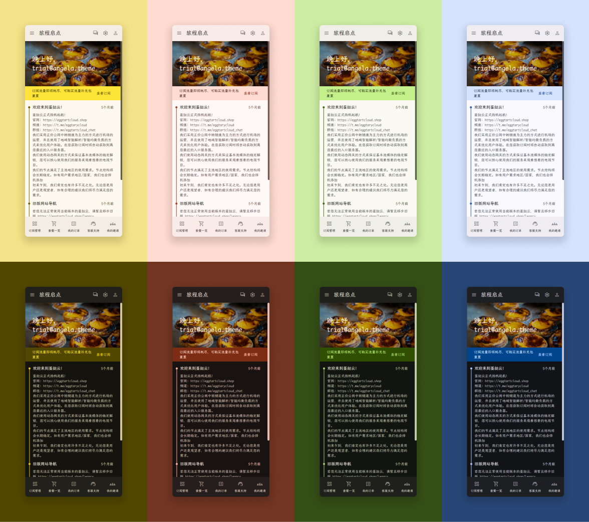
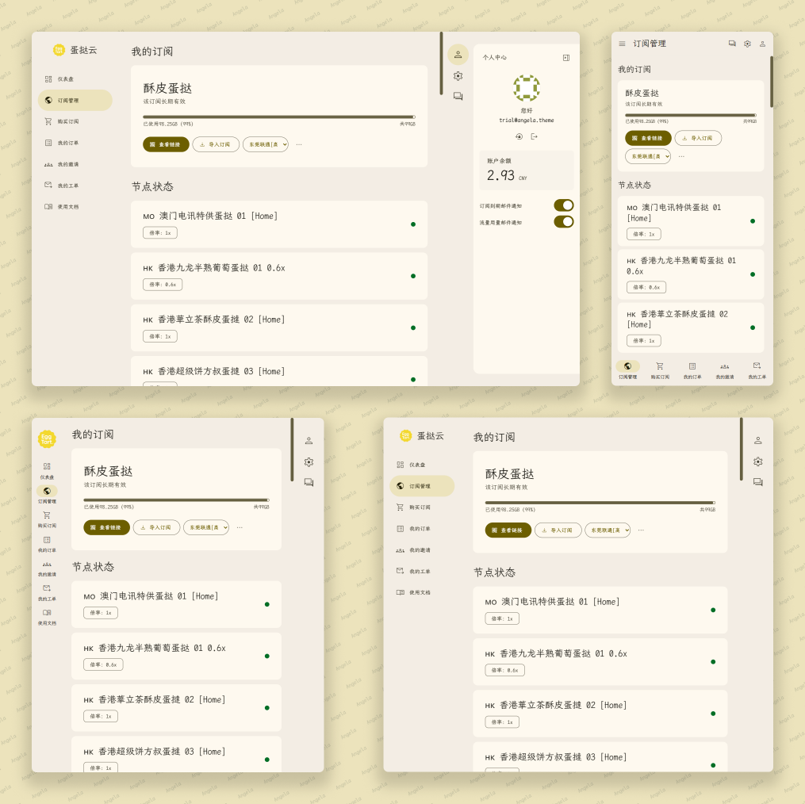
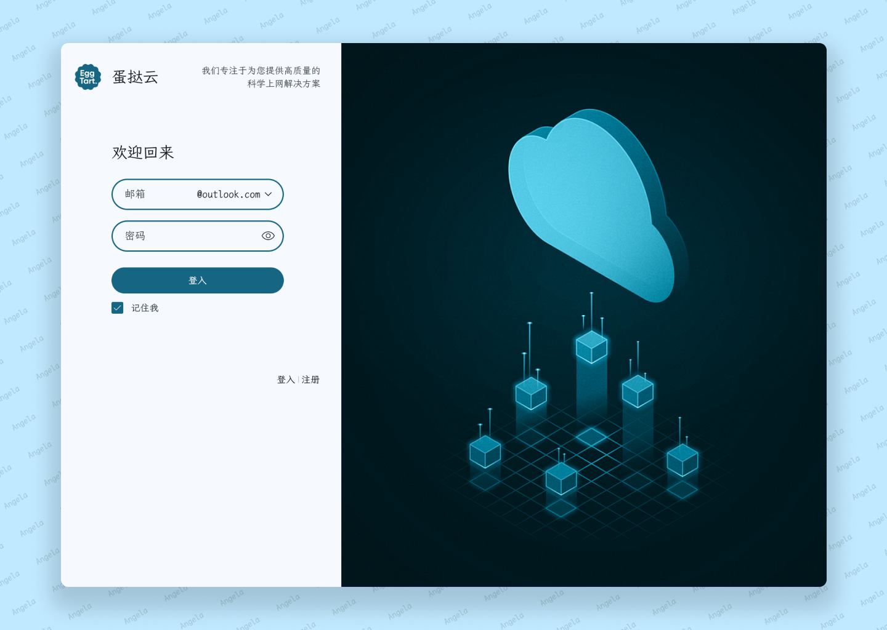
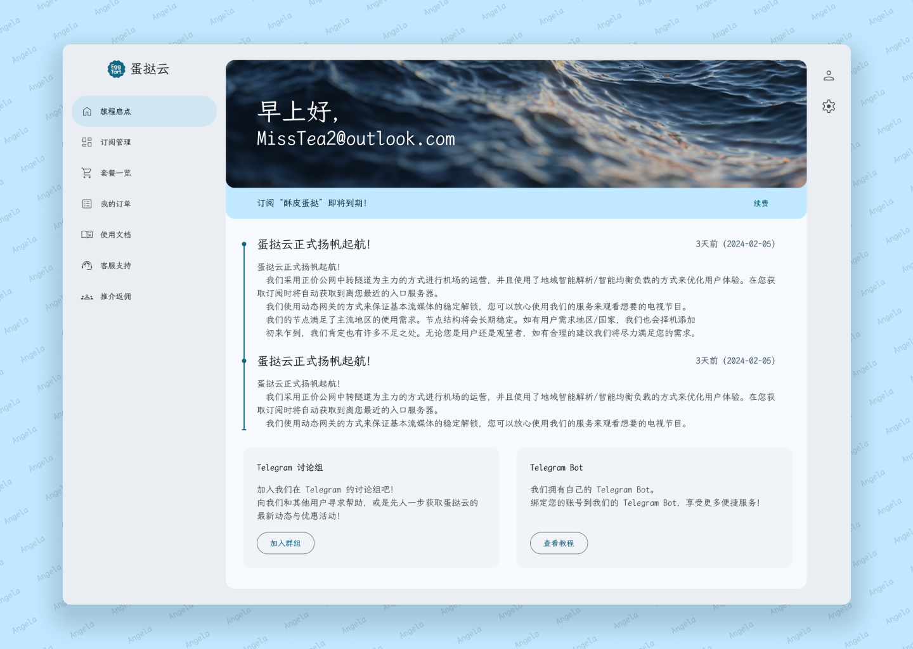
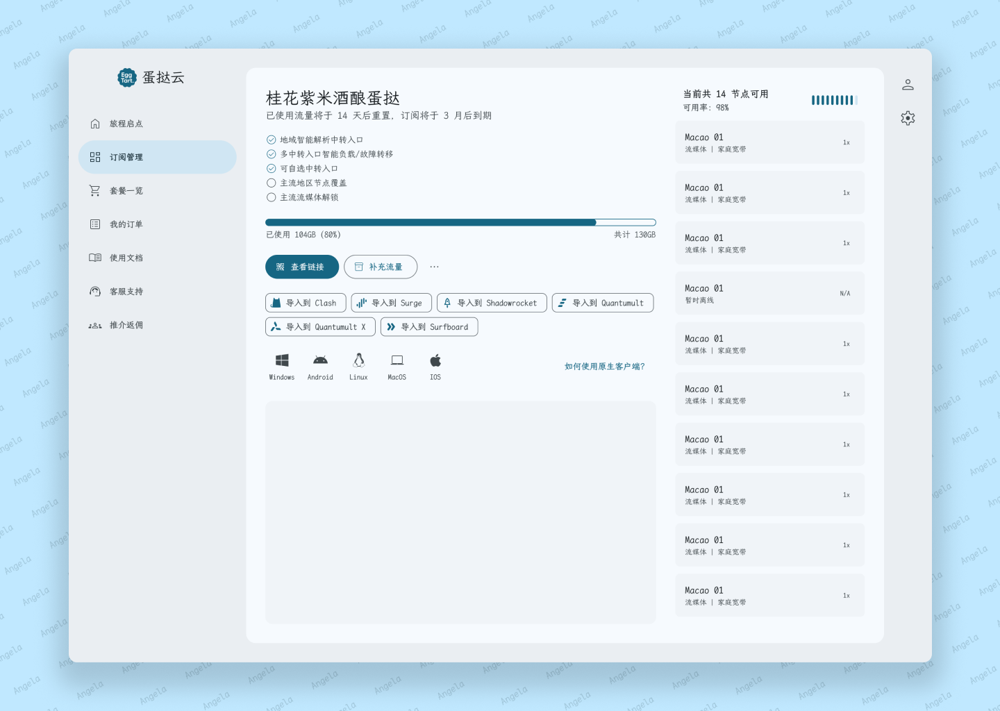
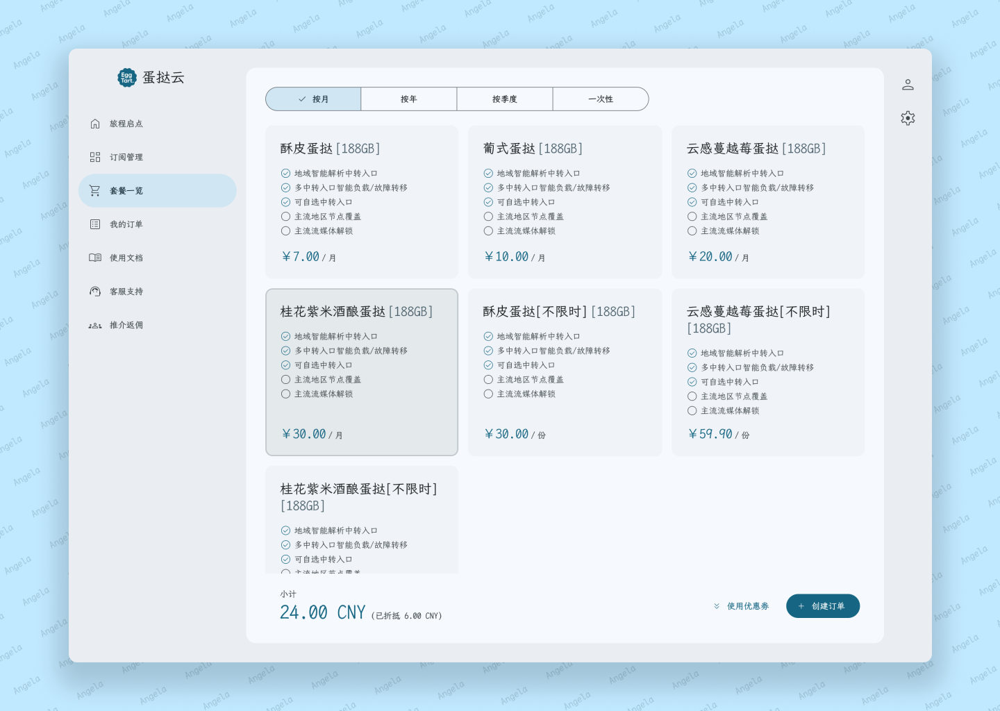
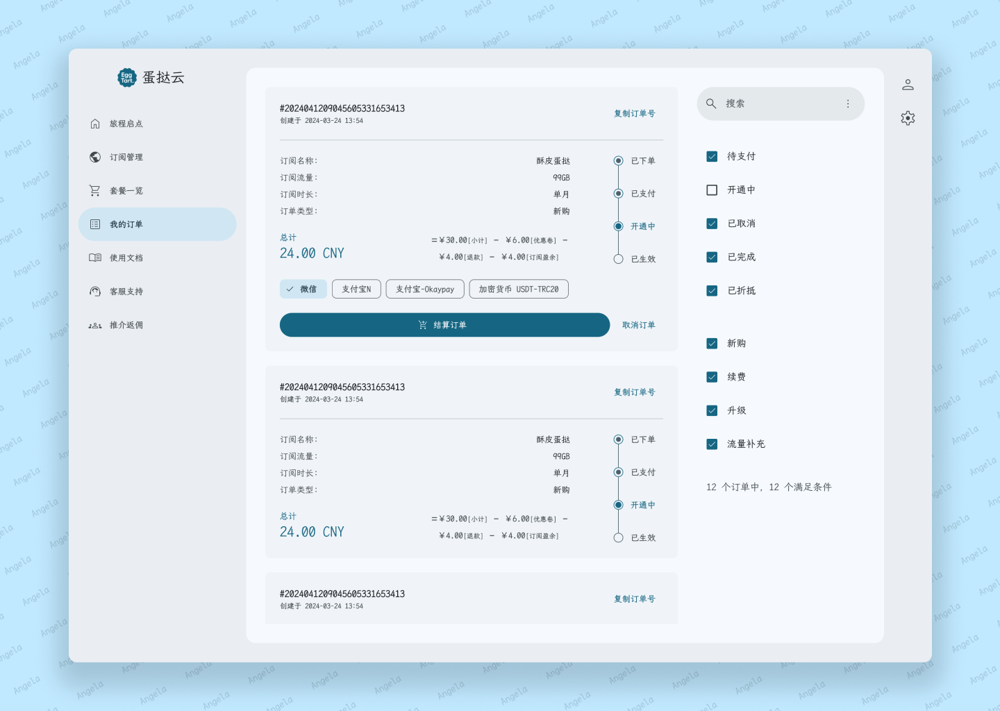

# Angela：品牌专属的视觉语言

Angela，一款以用户体验为核心设计的 V2board Web 面板，由 [Angular](https://angular.dev) 驱动，汲取 [Material Design](https://m3.material.io/) 的设计精髓，为您的品牌注入独特的视觉语言。

> [!NOTE]
> Angela 正在向 v2.0 的里程碑迈进，用户界面设计存在大量变更，您可能会看到同一个页面的不同外观。

Angela 具有以下核心优势：

1. 完全动态生成的配色方案:  
   利用 Angela 独家的配色算法，基于任意种子色，打造最贴合品牌形象的专属配色方案
1. 四种精心设计的布局方案:  
   适配手机、平板、笔记本、台式机的任意屏幕朝向，在任何设备上提供同水准的用户体验
1. 丝滑流畅的交互设计：  
   通过精心打磨的界面动效，留下最深刻的品牌印象，传递以用户为中心的品牌态度

## 设计

